# CW1: An Unknown Signal <!-- omit in toc -->

# 1. Implementation

## 1.1. Determining the line functions

**Line** classification is a large part of this project so the first thing to do is define the set of potential line types. For each of the training sets provided, a plot was generated. By examining these plots the line functions can be determined to be linear, cubic, and sinusoidal.

## 1.2. Splitting the data

Each line segment is exactly 20 data points. As each line segment is being considered individually, the first step is to separate the data into chunks. This can be done simply using `numpy.array_split(data, len(data // 20))`.

## 1.3. Estimating function variables

Least squares regression is a method of estimating the function variables used to generate a line.

The matrix form formula of least squares is given by $A=(X^T.X)^{-1}.X^T.Y=[a', b', ...]$. This can be easily represented with `numpy.linalg.inv(X.T.dot(X)).dot(X.T).dot(Y)`.

## 1.4. Calculating error

The reconstruction error of our generated regression lines is the sum squared error. The formula for calculating the sum squared error is $\sum_i (\hat{y}_i - y_i)^2$ which can be calculated with `numpy.sum((y_hat - y) ** 2)`.

## 1.5. Line classification

Lines can be simply classified as the function which gives the lowest reconstruction error. However, each line segment is made up of only 20 data points; this is quite limited in size and means any outliers may have a large effect on the model and lead to overfitting.

To prevent this overfit, a model validation technique such as k-fold cross-validation can be used. In my implementation I chose to use a k-value of 20 (making it the same as leave-one-out cross-validation).

The process of performing k-fold cross-validation is as follows:

1. Shuffle the dataset randomly while maintaining `x` and `y` pairings
2. Split the dataset into `k` groups of approximately equal size
3. For each group:
   1. Use the group as a test set
   2. Form a training set from the remaining groups
   3. Estimate a regression line using the training data and calculate it's sum-squared error against the test data
4. Calculate the mean error

To classify our line segments we now instead choose the function that gives the lowest mean reconstruction error using k-fold cross-validation.

# 2. Figures

Basic Graphs:

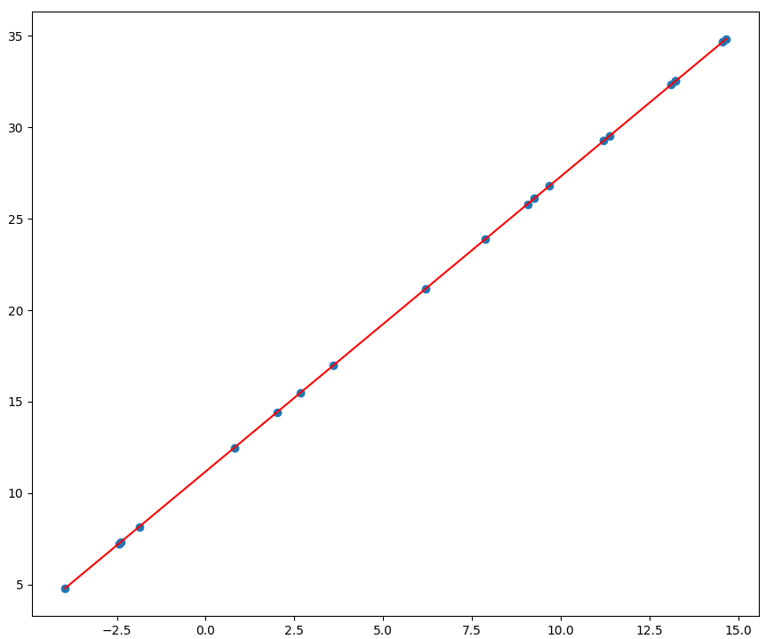
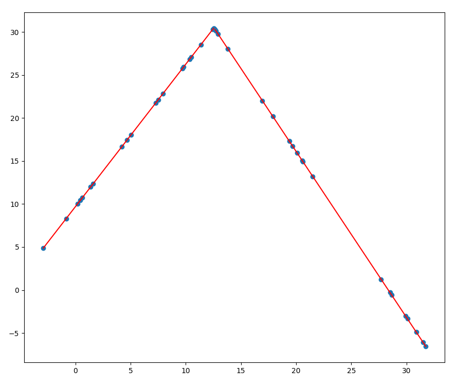
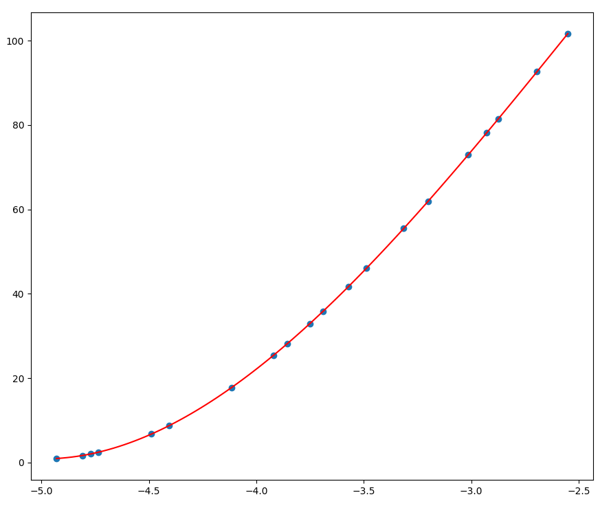
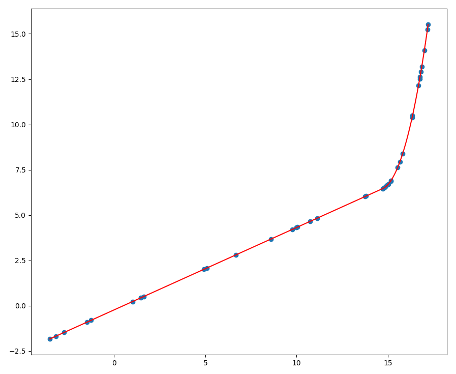
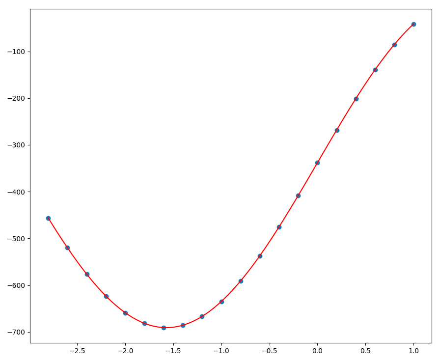

Advanced graphs:

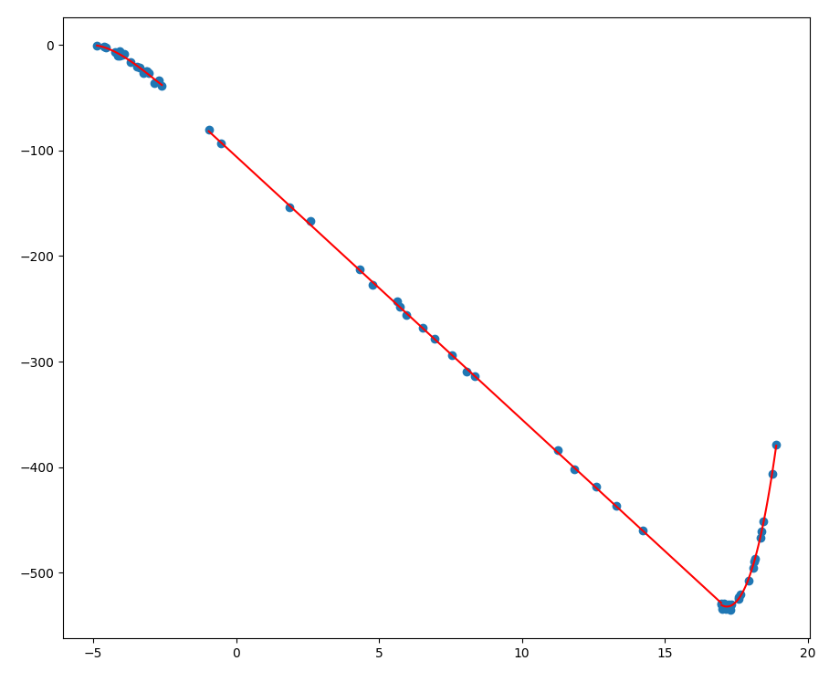
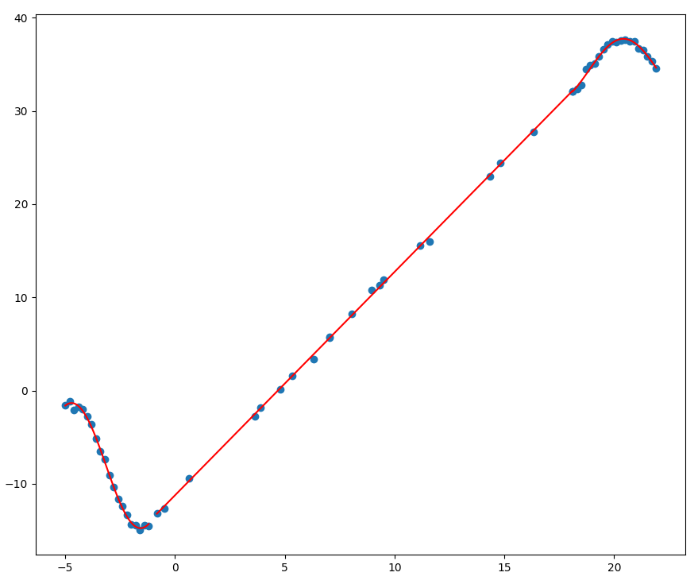
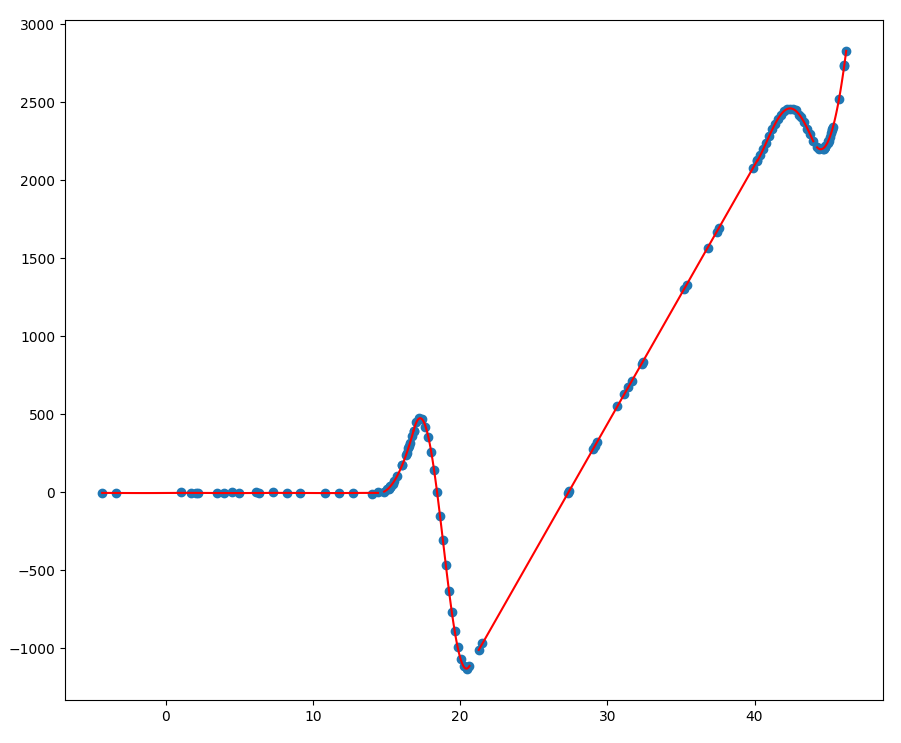

Noisy graphs:

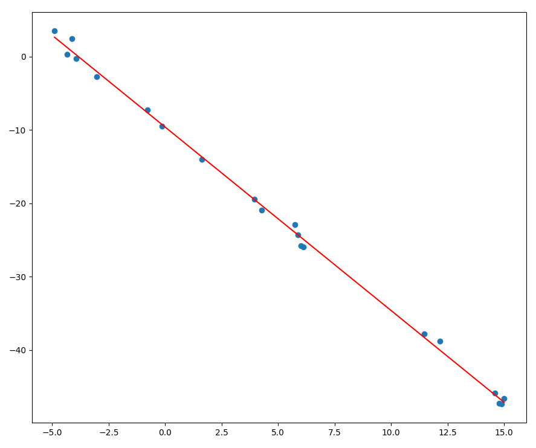
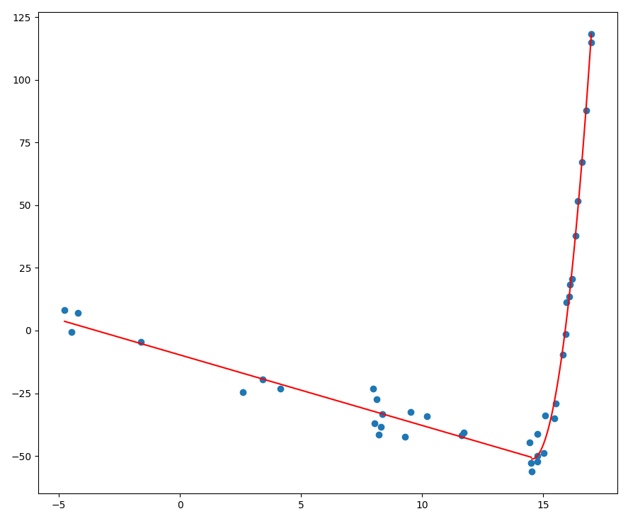
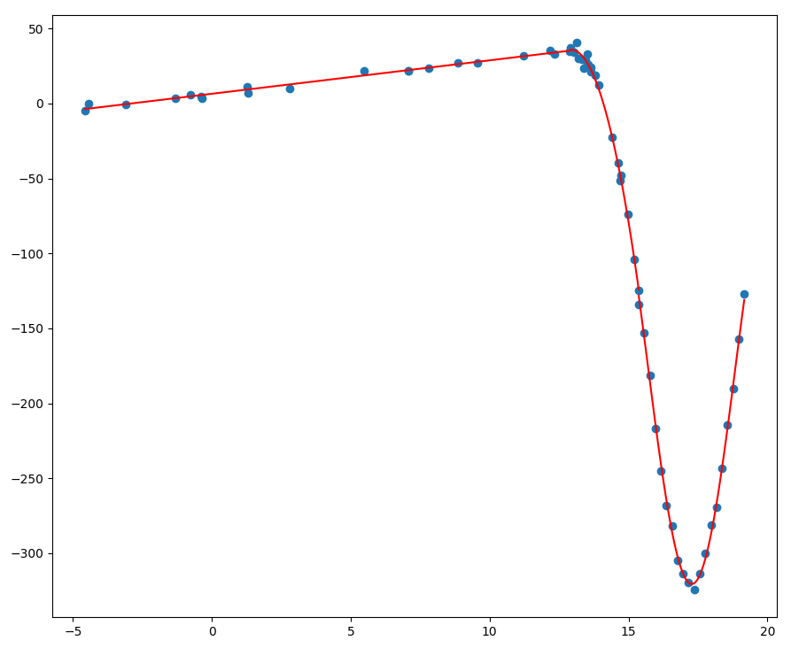

# 3. Potential extensions

## 3.1. Continuous lines

My current solution considers each line segment independently of the others meaning that when plotted the lines do not connect. However, the lines may have been produced in such a way that it should a continous line should be produced. I'm not sure how I would go about calculating such a line of best fit but it may be more accurate to the generating functions.

## 3.2. More line functions

The coursework only requires support for the three line functions used, which I determined to be linear, cubic, and sinusoidal. Adding support for more line functions such as exponential could be a good extension.

## 3.3. Variable line segment lengths

All line segments in this coursework are made up of 20 data points and my solution uses this to easily split the data up. Support for line segments of any length could be a nice thing to add. However this would require a way to work out when line segments start/end which may be complicated.
